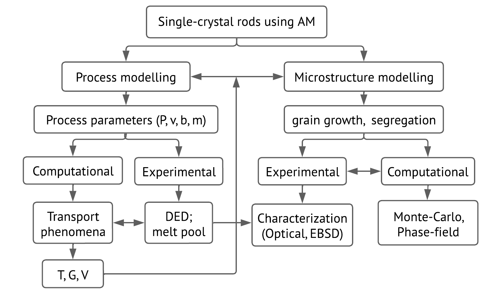
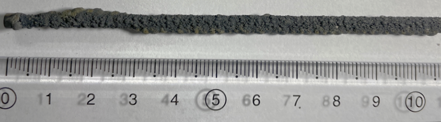
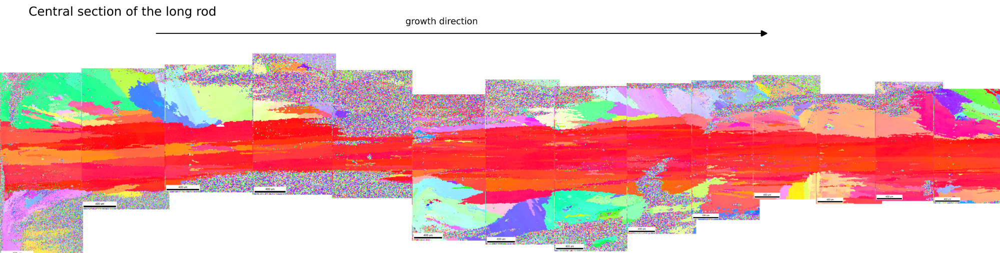

#### Multi-scale modelling, simulation and experimental study of metal additive manufacturing process

##### Aim: To produce single-crystal CMSX-4 (Ni-based superalloy) rods using additive manufacturing

We have divided our study into two major parts, ‘process modelling’ and ‘microstructure modelling’. Figure 1 shows the schematic view of the research plan.

<figure>
  

  <figcaption>Figure 1: Schematic view of the research plan. </figcaption>

</figure>

##### I. Modelling and simulation:

**Process model:**

We have developed a novel 3D process model that simulates heat transfer, fluid flow and powder deposition for a multi-layer laser scan of metal additive manufacturing process. The model takes actual experimental process parameters like laser power (P), scanning velocity (v), beam radius (b), powder flow rate (ṁ), layer thickness (z), etc. along with thermodynamic properties of the material as input. The model includes important physics like Gaussian laser heat source; conduction, convection and radiation mode of heat transfer; latent heat evolution during solidification and evaporation; Marangoni and Buoyancy driven flows; keyhole formation due to vapor pressure; and powder deposition.
The existing AM models mainly use volume of fluid method (VoF) or level set method. There are couple of issues with these models. Firstly, we observed that both the methods suffer from interface diffusion i.e. the interface width does not stay uniform. To address this issue, the interface field equation is solved until it reaches steady state. This is implemented using sophisticated algorithm like MULES which are difficult to code and computationally expensive. We have developed a new phase-field equation to address this issue. By its inherent nature, the equation keeps the interface width uniform and can be easily controlled by choosing appropriate value of interface scaling parameter. Secondly, the methods suffer from numerical diffusion due to large difference in properties of gas and metal like density and thermal conductivity. This causes unrealistic diffusion of heat into the gas. To tackle this, the temperature evolution equation in solved only in metal region. Heat losses from metal to gas due to conduction, convection, radiation and evaporation are accounted via source terms which act at the gas-metal interface. Fig 2 shows the temperature map of a multi-layer thin-wall simulation.

<figure>
  

  
  <figcaption>Figure 2: 3D and 2D plots of T for multi-layer deposition (a) 3D T plot (b) 2D T plot with solidus and liquidus tem-
 perature contours </figcaption>

</figure>

**Grain growth model:**

The temperature data output from the process model is used to simulate grain-growth using Monte-Carlo model. Fig 3 shows final grain structure for temperature data obtained from AM simulation shown in fig 2. When deposition is done on a poly-crystalline substrate, the final grain structure comes out as columnar as shown in fig 3a. On the other hand, when deposition is done on a single-crystal substrate the simulation shows mostly single-crystal growth (3b).

<figure>
  

  
  <figcaption>Figure 3: Final grain structure plots using Monte-Carlo simulation done based on T data from process model simulation (a) poly-crystalline substrate (b) single-crystal substrate </figcaption>

</figure>

#### II. Experiments:

We have correlated the simulations by building thin-walls and rods and optimising the process parameters to get maximum columnar growth. One of the experimental results are shown in fig 4. Fig 4a shows a rod printed with IN718 powder on a CMSX-4 single-crystal substrate. In fig 4b, an EBSD map of 14mm long longitudinal section of the rod shows close to single-crystal growth.

With the combined understanding of experiments and simulations, we have observed a strong correlation between the shape of the melt pool during the process and the final microstructure. Ignoring important physics like fluid-flow in melt pool drastically changes the shape of the melt pool. Hence, accurate simulation of melt-pool is essential to predict the microstructure. If we start with a single-
crystal substrate, then single-crystal builds can be achieved with optimised process parameters.

<figure>
  

  
  <figcaption>Figure 4: Rod sample printed on a single-crystal substrate (a) sample image with scale (b)EBSD image of 14mm long longitudinal section </figcaption>

</figure>
